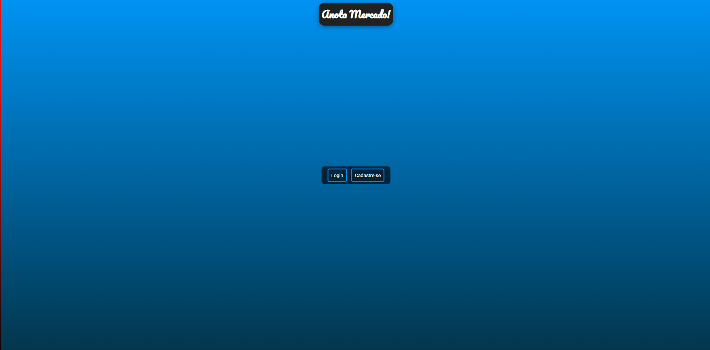
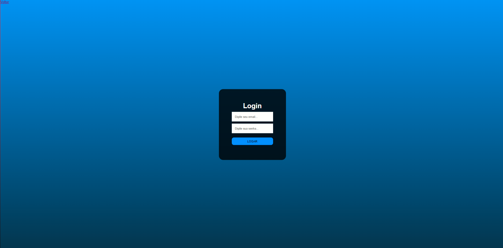
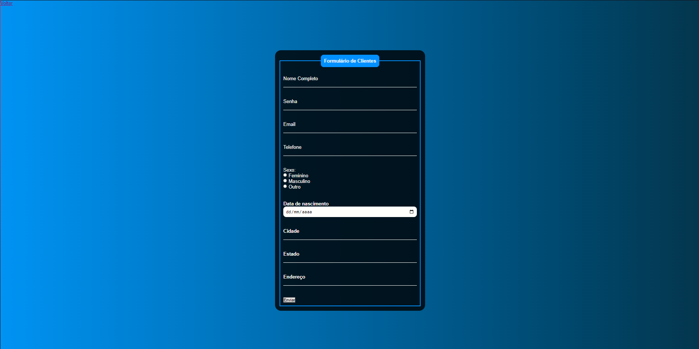
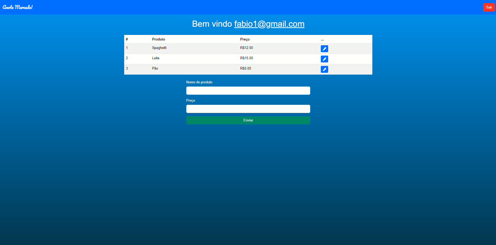

# Anota Mercado! 

- Aplicação web voltada a criação de conta associada a uma lista de compras de supermecado

## Tecnologias Usadas 💻

- PHP
- HTML
- CSS
- Bootstrap
- MySql

## Telas

## Como inicializar
1. Fazer instalação do xampp e executar o apache e mysql
2. clonar repo e colocá-lo na pasta htdocs do xampp
3. Inserir código sql do arquivo config.sql no BD
4. Mudar config.php para parâmetros do seu BD
5. Abrir no navegador link: http://localhost/projetoMonolitico/home.php
